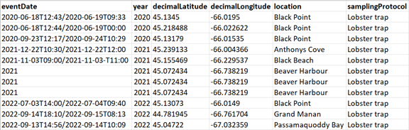

# Appendices

## Biodiversity Data and Definition of Terms  

This appendix is ​​intended to provide information on the DarwinCore format.  

The DarwinCore format structure is based on the principles of Event Cores, which are associated with Occurrence Extension tables and, where applicable, Extended Measurements (or Facts) derived from occurrences and events (Occurrence and Event EMoF). Unique identifiers (eventID, occurrenceID, measurementID) are used to link these tables.  

## Event Table (Event Core)  

* The Event Table is part of the Darwin Core data structure, contained in a separate spreadsheet (e.g., an .xlsx file), which contains information about collection or observation events associated with specimens or occurrences.
* This table allows us to document the contextual details surrounding the collection or observation of species, which is crucial for understanding, interpreting, and comparing biodiversity data.   

An Event Table therefore provides information about where and when specimen observations were made and where abiotic measurements were taken to characterize the environments where the observations took place. The essential variables that must be included include:  

- Date and time (at least the year);  
- Geographic coordinates;  
- Geographic coordinate reference system;  
- A brief description of the sampling protocol (a few words are sufficient).  

## Occurrence Table (Occurrence Extension)

* The occurrence table is another part of the Darwin Core data structure, also included in a separate spreadsheet, which allows you to indicate **which specimens** were observed and their abundance during different events;  
* It constitutes a kind of **inventory of the biodiversity** observed (or not observed) based on the events.  

The variables to include are:  

- The scientific name of the observed species;  
- The occurrence status;  
- The "BasisOfRecord".  

**Occurrence Table Structure**  

When biodiversity data is collected, such as for an inventory, it is required to create a spreadsheet specifically dedicated to marking observations, i.e., occurrences.   

  
/// caption
Minimal structure of an archiving structure meeting Darwin Core standards.
///  

## Occurrence Measurements Table (EMoF Occurrence)  

* The occurrence measurements table is an extension file associated with the occurrences table;  
* It allows you to record specific measurements, such as length, weight, sex, etc., associated with individual species occurrences;  
* Each record in the occurrence measurements table is linked to a specific occurrence and contains information about the measurement taken, as well as other relevant metadata such as the measurement method, unit of measurement, etc.;  
* This table complements the occurrence data by providing additional quantitative or qualitative details about each specimen, allowing for more in-depth biodiversity analysis based on data collected in the field or in other collection contexts.  

In the figure below, there is a fourth table corresponding to the extended measurements taken on occurrences. However, this guide will not focus on this table. Physicochemical measurements taken during events (Event EMoF), such as water temperature, marine substrate qualification, water level, etc. can be integrated directly into the event table (Event Core).  

  
/// caption
Darwin Core relational tables.
///

## Unique Identifiers   

First, it's important to note that **each line in a data file must have its own unique identifier**. There are different names for the variable that refers to the unique identifier. OBIS and Darwin Core define several types, but the ones this guide focuses on are:  

- EventID  
- OccurrenceID  
- MeasurementID  

**eventID**  

* The eventID refers to a specific **event**, such as an observation or a field collection;  
* This identifier is assigned to a set of occurrences that were collected simultaneously during the same field operation;  
* For example, during a quadrat inventory of herbaceous plants, each quadrat could have its own eventID. Each occurrence, each species observed in the same quadrat, would therefore share this eventID.  

**occurrenceID**  

* The occurrenceID is a unique identifier assigned to each occurrence;  
* It allows tracking and referencing **each distinct observation** made during an event;  
* For example, if ten specimens of the same species are observed during the same event, a row containing the required variables and the number of specimens observed (10) will be noted in the spreadsheet, and a unique occurrenceID will be assigned to this observation.  

**measurementID**  

* The measurementID is used to uniquely identify **each measurement or observation associated with an occurrence**.  
* It is typically used in the context of data associated with specific measurements, such as a specimen's length, weight, etc.  
* For example, if multiple measurements are taken on a specimen (such as length, width, etc.), each measurement could be individually identified by a unique measurementID.  

Essentially, when building an occurrence table from an event table, the goal is to use this structure to indicate which specimen observations were made during a particular event. The same principle applies to the measurement table for occurrences or events. Thus, each measurement is grouped into an occurrence and each occurrence into an event using identifiers.  

**How ​​to create a unique identifier:**  

First, you should know that each identifier must be globally unique, meaning it must not exist in any other database anywhere else in the world. The more information you add to the unique identifier, the closer you get to this theoretical goal of making it globally unique. To create a unique identifier for the event, you can use information already contained in the spreadsheet: the quadrat number, an abbreviation of the site name, the year the observation was made, etc. You can also add information such as the name of the organization that collected the data, as well as other specific information that could make the identifier truly unique. Subsequently, to create an occurrence identifier, you can simply add a code or abbreviation referring to the observed species. Using the same logic, you can then add an abbreviation of the measurement to create a measurement identifier.  

## Occurrence Status  

The **occurrenceStatus** variable refers to the presence or absence of an organism in a given location at a given time. This variable is used to describe whether a specimen or observation of a particular species was observed or collected in a specific location at a given time.  

There are only two possible values ​​that can be entered under the occurrenceStatus variable: ***present*** and ***absent*** (without accent). The OGSL provides definitions for each value:  

* Present: When the occurrenceStatus is defined as "present," it means that the organism in question was observed or collected in the study area or at the specified location. Presence can be confirmed by direct detection of the organism itself or by indirect methods such as acoustic recordings or DNA traces. * Absent: When the occurrence status is defined as "absent," it indicates that the organism in question has not been observed or collected in the study area or at the specified location. This can mean that an exhaustive search was conducted and no trace of the organism was found, or that the organism is known to be absent from that specific geographic area or habitat.  

It is important to note that determining whether a species is absent can be influenced by a variety of factors, including data collection techniques, seasons, environmental conditions, and observer skill. Absence can essentially mean two distinct facts: (1) in a given place and time, the specimen was not observed, but it is not possible to say that it does not exist at that given location; or (2) the specimen is absent because it does not exist at that given location. These two interpretations can lead to completely different conclusions.  

Therefore, it is recommended to provide information on data collection methods and the reliability of observations when using the occurrenceStatus variable. Therefore, if you notice the absence of a specimen, also note the *absence*, as this information will be relevant to include in the metadata.  

The **samplingProtocol** variable, which must appear in the Event Core table, allows you to clarify the notion of absence, if applicable.  

## The "Basis of Record"  

In the context of the Darwin Core standard, the ***basisOfRecord*** variable describes the nature of the observation that served as the source for the recorded data. It provides information about how the data were obtained and the form in which they are stored.  

The possible values ​​are standardized, meaning that the values ​​must be chosen from the values ​​defined by the Darwin Core. The most commonly used are generally *PreservedSpecimen*, *LivingSpecimen*, and *HumanObservation*. The definitions we propose are intended to make it easier to determine which value to choose:  

**PreservedSpecimen:** This value indicates that the data were collected from a preserved specimen, typically in a museum, collection, or other similar institution. Preserved specimens can include mounted animals, dried plants, DNA samples, etc.  

Example: A fish inventory is conducted for a given location. Some fish are frozen to take certain measurements (such as size, sex, etc.). In the table of specimen measurements, under the *basisOfRecord* variable, you should enter *PreservedSpecimen*.  

**LivingSpecimen:** This value indicates that the data was collected from a living specimen, i.e., an organism that is still alive at the time of data collection. This can include field observations of animals, plants, or other living organisms.  

Example: A fish inventory is conducted for a given location. The fish are caught, counted, and measurements are taken. The fish are finally released back into the water. In the tables of occurrences and specimen measurements, under the *basisOfRecord* variable, you should enter *LivingSpecimen*.  

**HumanObservation:** This value indicates that the data was collected through direct observation by a human observer. For example, observations of animal behavior in the wild, field surveys conducted by scientists or amateur naturalists, etc.  

## The Sampling Protocol  

The **samplingProtocol** variable must appear in the Event Core table. The Event Core table is used to record information about sampling or observation events, i.e., occasions when biological samples were collected or observations were made.  

  

In this table, each row represents a distinct sampling or observation event. The samplingProtocol variable is used to record the specific protocol or method used during this event to collect biological samples or observe organisms.  

If multiple sampling protocols were applied during the same event, Darwin Core recommends separating values ​​using a space-pipe-space character (“ | “).  

Ex: Lobster trap | Modified lobster trap  