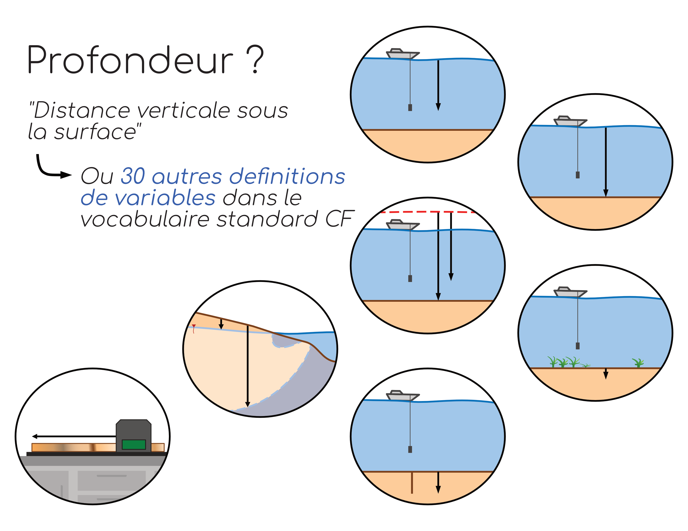

# Dictionnaire

## Pourquoi un dictionnaire ?

Afin de faciliter la réutilisation et l'intéropérabilité des données, il est important d'utiliser un vocabulaire commun pour désigner les différentes variables. Certains standards ont été conçus à cet effet tels que le vocabulaire de la [Convention CF](https://cfconventions.org/) pour les données océanographique de physico-chimie, ou encore le vocabulaire issu du [Darwin Core](https://dwc.tdwg.org/list/) pour les données de biologie et de biodiversité. Ces vocabulaires contrôlés assignent à des termes uniques une variable précise. Ainsi par exemple, en dehors de tout standard, une simple variable _profondeur_ pourrait être interprété de très nombreuses manières (figure ci-dessous). Dans la convention CF par contre, _depth_ sera spécifiquement défini par la "distance verticale sous la surface" et d'autres variables tels que *sea_floor_depth* désignera précisement la profondeur du fond marin depuis la surface de l'eau. 

## liste des variables et descriptions

## epsg (système de coordonnées de référence)

## instruments de récolte de données

## définition de la méthode