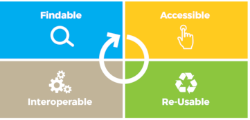
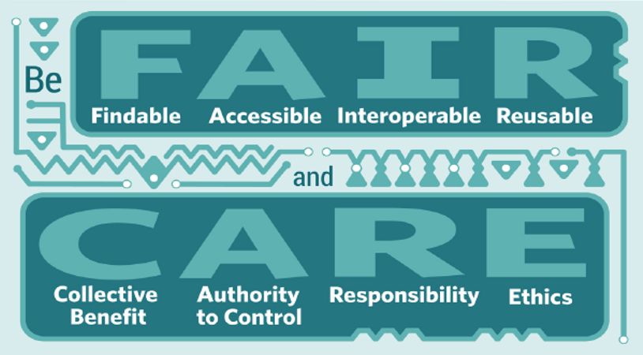

# FAIR and CARE Principles 

## FAIR Principles

A vast amount of information is now available online and continues to be generated daily by an increasingly technology-driven science. To ensure that data remains easily discoverable and accessible, certain practices can be adopted to guide this process. The [FAIR principles](https://www.go-fair.org/fair-principles/) (Findable, Accessible, Interoperable, Reusable) aim to make data discoverable, accessible, interoperable, and reusable.  

These are guiding principles—concepts designed to help data stewards standardize and structure their data for archiving and dissemination. The principles were defined in 2015 during a workshop held in Leiden, the Netherlands.  

  

### Findable  

Findable data can be ensured by defining a unique persistent identifier (e.g. DOI or URL), by following the data with rich metadata following recognized norms that itself includes the identifier, and finally, ensuring an indexed presence in both regional and international data discovery portals or search engines.  

### Accessible  

Being accessible means that data can be easily obtained by humans as well as by machines, through well-defined and ideally standardized protocols. Access conditions must be clearly established (license, reuse rights, etc.). Even when the data is inaccessible, the metadata should remain so in a way that the dataset remains discoverable. The author of the dataset can then be reached for more information or for a data access request (for example, under specific conditions).  

### Interoperable  

Interoperability makes it possible to integrate different data into a single interface, for example within the same web application. This can be achieved in a variety of ways, including: the use of a common programming language, the use of controlled vocabulary, as well as non-proprietary formats. The same efforts can be applied to metadata as well as references to other (meta)data.  

### Reusable  

By having data and metadata following best practices, it is possible to optimize them for reuse. Data and metadata must be richly detailed, as well as user licenses. Any information specific to the field of interest of the data in question must be made available as well.  

## CARE Principles  

The [CARE principles](https://www.gida-global.org/care) were developed in 2018 at the Indigenous Data Sovereignty Principles for the Governance of Indigenous Data Workshop in Gaborone, Botswana.   
These principles are people- and purpose-oriented. They complement the data-centric approach represented in the FAIR principles.  
 
Historically plagued with issues of inequality and exploitation related to the capture of data about their communities and territories, Indigenous Peoples insist on the need to integrate their knowledge and approaches into data practices and policies. This becomes even more important as the volume and willingness to reuse data increases. Faced with a growing desire to make data open, Indigenous Peoples are articulating their rights and interests in data to reclaim its control ([Russo Carroll et al. (2020)](https://www.nature.com/articles/s41597-021-00892-0)). These elements are expressed in the CARE principles.  

   

### Collective Benefit  
Data systems must enable inclusive development, better governance and citizen involvement, and equitable outcomes for Indigenous communities.  

### Authority to Control  
The rights and interests of Indigenous people over their data must be recognized and respected. That authority must be empowered.  

### Responsibility  
Working with Indigenous data requires an increased responsibility to develop positive and respectful relationships.  

### Ethics  
Minimize damages and maximize gains, without stigmatizing or devaluing indigenous peoples, their cultures or their knowledge.
Potential future uses are taken into account in data governance. Data limitations and requirements are noted.  
