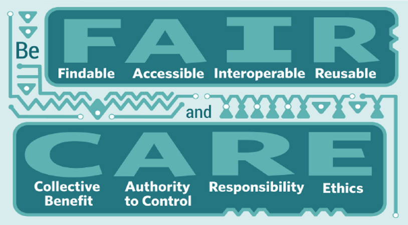

# Principes FAIR et CARE  

## Principes FAIR

De vastes quantités d’information sont aujourd’hui disponibles en ligne et continuent d’être générées quotidiennement par une science de plus en plus technologique. Afin d’assurer que les données soient toujours facilement découvrables et accessibles, certaines pratiques peuvent être mises en place pour guider cette démarche. Les [principes FAIR](https://www.go-fair.org/fair-principles/) (*Findable, Accessible, Interoperable, Reusable*) visent à rendre les données découvrables, accessibles, interopérables et réutilisables.

Il s’agit de principes directeurs, c’est-à-dire de concepts permettant de guider les gestionnaires de données dans la normalisation et la structuration de leurs données en vue de l’archivage et de la diffusion. Ces principes ont été définis en 2015 lors d’un atelier tenu à Leiden, aux Pays-Bas.

### Découvrable

Être découvrable signifie avoir un identifiant persistant unique (ex. DOI ou URL), être décrit par de riches métadonnées respectant des normes reconnues et enfin, assurer une présence dans les portails de découverte de données autant locaux que nationaux.

### Accessible

Être accessible signifie que les données peuvent être facilement obtenues autant par des humains que par les machines, selon des protocoles définis et idéalement standardisés. Les conditions d’accès doivent être clairement établies (licence, droits de réutilisation, etc.). Même quand les données sont inaccessibles, les métadonnées demeurent accessibles afin que le jeu de données reste découvrable. L’auteur du jeu de données pourra alors être contacté pour obtenir davantage d’information, ou une demande d’accès aux données pourra être effectuée (par exemple, sous certaines conditions).  

### Interopérable

L’interopérabilité rend possible l’intégration de différents jeux de données sur un portail unique, par exemple au sein de la même application web. Cela peut être assuré de différentes manières, incluant : l’utilisation d’un langage de programmation commun, l’utilisation d’un vocabulaire contrôlé, ainsi que de formats non-propriétaires. Les mêmes efforts peuvent être appliqués aux métadonnées ainsi que les références vers d’autres (méta)données.  

### Réutilisable

En ayant des données et des métadonnées suivant les meilleures pratiques, il est possible les optimiser afin qu’elles soient réutilisées. Les données comme les métadonnées doivent alors être richement détaillées, ainsi que les licences d’utilisation, et toute information spécifique au domaine d’intérêt des données en question.   

## Principes CARE  

Les [principes CARE](https://www.gida-global.org/care) ont été développés en 2018 lors du Indigenous Data Sovereignty Principles for the Governance of Indigenous Data Workshop, à Gaborone, au Botswana.

Ces principes cherchent à mettre de l’avant les personnes et les communautés touchées par la collecte des données et s’intéressent à ses objectifs et ses finalités. Ils s’inscrivent ainsi en compléments aux principes FAIR qui, eux, posent les données au centre de la réflexion.

Historiquement confrontées à des enjeux d’inégalité et d’exploitation liés à la saisie de données sur leurs communautés et leurs territoires, les populations autochtones insistent sur la nécessité d’intégrer leurs connaissances et leurs approches dans les pratiques et politiques en matière de données. Cela revêt une importance accrue dans un contexte où le volume et la volonté de réutiliser des données augmentent. Confrontés à une volonté grandissante de rendre les données ouvertes, les peuples autochtones articulent leurs droits et leurs intérêts sur les données afin d’en réclamer le contrôle ([Russo Carroll et al., 2020](https://www.nature.com/articles/s41597-021-00892-0)). Ces éléments s’expriment dans les principes CARE.

  

### Collectivement bénéfique

Les systèmes de données doivent permettre un développement inclusif, une meilleure gouvernance, une implication citoyenne accrue et des retombées équitables pour les communautés autochtones.

### Autorité de contrôle

Les droits et les intérêts des personnes autochtones sur leurs données doivent être reconnus et respectés. Le pouvoir de contrôler ces données doit leur être habilité.

### Responsabilité

Travailler avec les données autochtones requiert une responsabilité accrue de développer des relations positives et respectueuses.

### Éthique

Minimiser les dommages et maximiser les gains, sans stigmatisation ou dévalorisation des peuples autochtones, leurs cultures ou leurs savoirs. Les usages futurs potentiels sont pris en compte dans la gouvernance des données. Les limites et les obligations se rapportant aux données sont indiquées.
