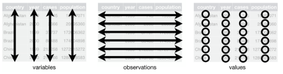

# Detailed Guide

The following page provides a summary of best practices and conventions to follow when it comes to data management.  

_This guide is being developed and will continue to be refined and expanded over time._

## 1. Basics  

- It is recommended to save and send tabular data files in .xlsx or .csv format.  

Try to name your files in a **concise and descriptive manner**. File names should be short, free of special characters, and contain no spaces.   
To separate words in a file or folder name, use underscores ( _ ) or hyphens ( - ). Avoid using periods in file names, as they can cause compatibility issues in some systems. Limit the use of accented characters.  

Examples of good and bad practices:  

✔️ 2024_BLABLA_Rimouski.xlsx  
❌ Figure 1.temperature.csv  
❌ Characterization project, heat bay - temperature data for the year 1990-1995.xlsx  

Three essential rules for promoting a good structure for tabular data files:  

1. Each variable should have its own column.
2. Each observation should have its own row.
3. Each value should have its own cell.  

  
  
/// caption
Figure 1. Vertical data and horizontal data.
///  

## 2. General Standards
### 2.1 Dates and Times

In data management, date and time entries must comply with the ISO 8601 standard. It can be broken down as follows:

yyyy-mm-ddThh:mm:ss-00:00	is equivalent to **year, month, day, T, hour, minute, second, UTC**  

2021-09-09T07:38:00-04:00	is equivalent to **Eastern Daylight Saving Time, therefore UTC-4\***  

2021-09-09T07:38:00-05:00	is equivalent to **Eastern Standard Time, therefore UTC-5\***  

\*These UTCs correspond to daylight saving time and Quebec standard time.  

**You don't have to enter the full ISO 8601 expression to record dates and times.**  

Here are some examples of accepted entries:

* yyyy-mm-dd  
* yyyy-mm  
* yyyy  

For archiving purposes, it is therefore not mandatory to enter full dates and times. The year alone is sufficient to make date entry acceptable.  

**However, the date entry format must remain consistent.**  

### 2.2 Geographic Coordinates  

Geographic coordinates are recorded using two distinct variables: **latitude** and **longitude**.  

They should always be recorded using decimal degrees (do not use coordinates in degrees-minutes, for example).  

Whenever possible, in the case of biodiversity data, each observation should have its own geographic coordinates. In other words, the identification of a specimen should also be accompanied by the recording of its GPS position.  

## 3. File Structure Examples

### 3.1 Biodiversity Data

**Fish Inventories**  

| eventDate&nbsp;&nbsp; | decimalLatitude | decimalLongitude | stationID | samplingProtocol | event&nbsp;&nbsp; | vernacularName&nbsp;&nbsp;&nbsp; | scientificName&nbsp;&nbsp;&nbsp;&nbsp; | occurrenceStatus | basisOfRecord  | longueur\_cm | individualCount |
| ---------- | --------------- | ---------------- | --------- | ---------------- | ------- | -------------------- | ---------------- | ---------------- | -------------- | ------------ | --------------- |
| 2024-10-16 | 48.1331         | \-69.1706        | P01       | senne            | trait 1 | Bar rayé            | Morone saxatilis | present          | livingSpecimen | 4.5          | 10              |
| 2024-07-16 | 48.1331         | \-69.1706        | P01       | senne            | trait 1 | Bar rayé            | Morone saxatilis | present          | livingSpecimen | NA           | 95              |
| 2024-07-16 | 48.1331         | \-69.1706        | P01       | senne            | trait 2 | Éperlan arc-en-ciel | Osmerus mordax   | present          | livingSpecimen | 10           | 2               |
| 2024-07-16 | 48.1331         | \-69.1706        | P01       | senne            | trait 2 | Éperlan arc-en-ciel | Osmerus mordax   | present          | livingSpecimen | NA           | 45              |
 
* *For more information on the [basisOfRecord](#the-basis-of-record) and the [occurrenceStatus](#the-status-of-occurrence) refer to Appendix 1*  

