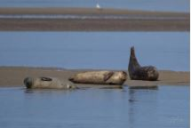
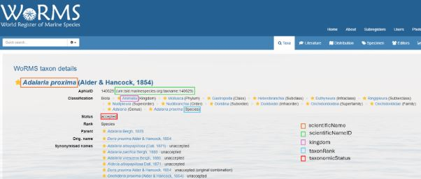

# Useful Resources

## Species Identification

In a data table, **it is important to record the observation with its scientific name**.

Indeed, the scientific name is universally accepted and used by scientists around the world, which avoids ambiguities and errors in translation or interpretation that can occur with vernacular names, which often vary by region or language.

***Specifications for Subspecies and Varieties***

The specification for subspecies and varieties varies depending on whether the specimen is from the animal kingdom (excluding Porifera) or the plant kingdom (including Porifera). When, in the animal kingdom, it is possible to identify a specimen to the taxonomic subspecies level, it should be noted as follows: 

    *Genus species subspecies*

*ex :  	Medora dalmatina montenegrina*

When, in the plant kingdom, it is possible to identify a specimen at the taxonomic level of subspecies or variety, it should be noted as follows:

    *Genus species subsp. subspecies*

    *Genus species var. variety*

_ex : 	Fucus distichus subsp. evanescens  ; Axinella tenuidigitata var. oxeata_

***The difference between « spp. » and « sp. »***  

Cases where the individual cannot be identified to the species level, but it is nevertheless possible to determine a higher taxonomic rank (genus, family, phylum, etc.).  

If the group of individuals contains multiple species or if observation cannot 100% confirm that it is a single species, "spp." should be used.  

Ex: Phoca spp.  

  

If the individual or group of individuals consists of only one species, "sp." should be used.  

   

Species information can be found by visiting the [World Register of Marine Species (WoRMS)](http://www.marinespecies.org/) website.  

   

| kingdom  | taxonRank | scientificName   | scientificNameID                          | taxonomicStatus |
| :------- | :-------- | :--------------- | :---------------------------------------- | :-------------- |
| Animalia | species   | Adalaria proxima | urn:lsid:marinespecies.org:taxname:140629 | accepted        |

If the scientific name is not accepted:  
   

**The key is to enter the exact "scientificName", compliant with WoRMS.**
You can also add the "kingdom", "taxonRank", "scientificNameID", and "occurrenceStatus", but if this is too much work, the OGSL can easily do it with our tools from the "scientificName" you entered.  

## Coordinate Transformation  

To convert coordinates to the desired format: [http://epsg.io/](http://epsg.io/) and select the "Transform coordinates" option:  

   

Enter the coordinates you want to change the format for and click the "Format" button. Click repeatedly until you find the decimal format (Format: dec). Make sure you select the correct Input Coordinates System in the upper left corner of the screen.  

  

**Identification of Transects and Quadrats**  

**Case Example**  

A 100-meter transect, with a start and end decimalLatitude/decimalLongitude. A quadrat every 5 meters with documented observations.  

All observations will therefore be located at a single central point, or along a single line. This is very imprecise when mapping habitats, for example.  

***Best practice*** would have been to use decimalLatitude/decimalLongitude for each quadrat. This way, the data can be reused for mapping.  

