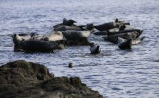
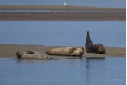
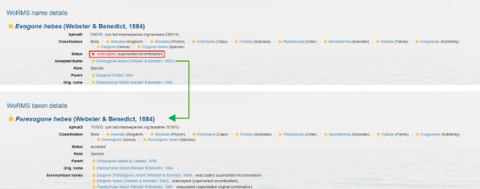
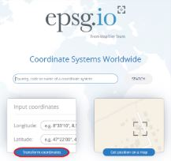
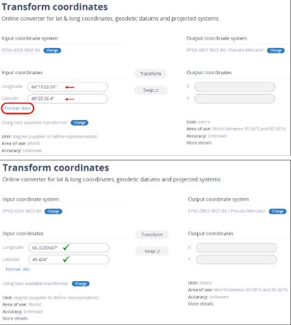

# Ressources utiles

## Identification des espèces

Dans un tableau de données, **il est important de noter l’observation avec le nom scientifique**.

De fait, le nom scientifique est universellement accepté et utilisé par les scientifiques à travers le monde, ce qui évite les ambiguïtés et les erreurs de traduction ou d'interprétation qui peuvent survenir avec les noms vernaculaires, qui varient souvent selon la région ou la langue.

***Spécifications quant aux sous-espèces et aux variétés***

La spécification quant aux sous-espèces et aux variétés change selon qu’il s’agit de spécimen du règne animal (à l’exception des Porifères) ou du règne végétal (en incluant les Porifères). Lorsque, dans le règne animal, il est possible d’identifier un spécimen au niveau taxonomique du sous-espèce, il convient de le noter ainsi :

    *Genre espèce sous-espèce*

*ex :  	Medora dalmatina montenegrina*

Lorsque, dans le règne végétal, il est possible d’identifier un spécimen au niveau taxonomique du sous-espèce ou de la variété, il convient de le noter ainsi :

    *Genre espèce subsp. sous-espèce*

    *Genre espèce var. variété*

_ex : 	Fucus distichus subsp. evanescens* ; Axinella tenuidigitata var. oxeata_

***La différence entre « spp. » et « sp. »***

Cas où l’individu ne peut pas être identifié au niveau de l’espèce, mais où il est néanmoins possible de déterminer un rang taxonomique supérieur (genre, famille, phylum, etc.)

Si le groupe d’individus contient plusieurs espèces ou si l’observation ne peut valider à 100 % qu’il s’agit d’une seule espèce, il faut utiliser « spp. ».

Ex: Phoca spp.

  

Si l’individu ou le groupe d’individu n’est composé que d’une seule espèce, il faut utiliser « sp. ».

Ex.: Phoca sp.

 

Les informations sur les espèces peuvent être trouvées en consultant le site du Registre mondial des espèces marines – World Register of Marine Species (WoRMS) :  [http://www.marinespecies.org/](http://www.marinespecies.org/).

 

| kingdom  | taxonRank | scientificName   | scientificNameID                          | taxonomicStatus |
| :------- | :-------- | :--------------- | :---------------------------------------- | :-------------- |
| Animalia | species   | Adalaria proxima | urn:lsid:marinespecies.org:taxname:140629 | accepted        |

Si le nom scientifique n'est pas accepté:
 

**L'essentiel est d’indiquer le “scientificName” exact, conforme à WoRMS.**
Vous pouvez aussi ajouter le “kingdom”, “taxonRank”, “scientificNameID” et le “occurrenceStatus”, mais si cela demande trop de travail, l’OGSL peut le faire aisément avec nos outils à partir du “scientificName” que vous avez saisi.  

## Transformation de coordonnées

Pour convertir les coordonnées au format désiré : [http://epsg.io/](http://epsg.io/) et sélectionner l’option “*Transform coordinates*” :

 

Entrer les coordonnées que vous désirez changer, et sélectionner le format en cliquant sur le bouton "Format". Cliquez plusieurs fois jusqu'à trouver le format décimal (Format : dec). Assurez-vous de sélectionner le bon système de projection de coordonnées (Input coordinates system) dans le coin supérieur gauche de l'écran.

 

**Identification des transects et quadrats**

**Exemple de cas**

Un transect de 100 m, decimalLatitude/decimalLongitude de début et de fin. Un quadrat à tous les 5 mètres avec des observations documentées.

Toutes les observations seront donc sous un seul même point central, ou sur une même ligne. Ce qui est très peu précis lorsque l’on souhaite cartographier les habitats par exemple.

La ***bonne pratique*** aurait été de prendre des decimalLatitude/decimalLongitude pour chacun des quadrats. De cette manière les données peuvent être réutilisées en cartographie.