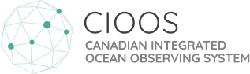
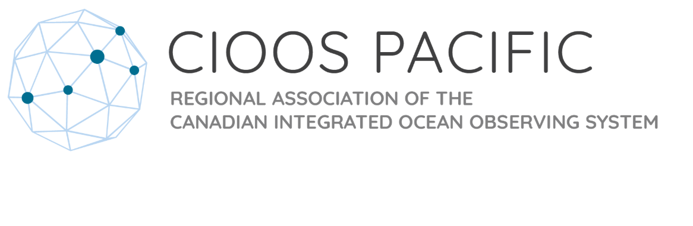
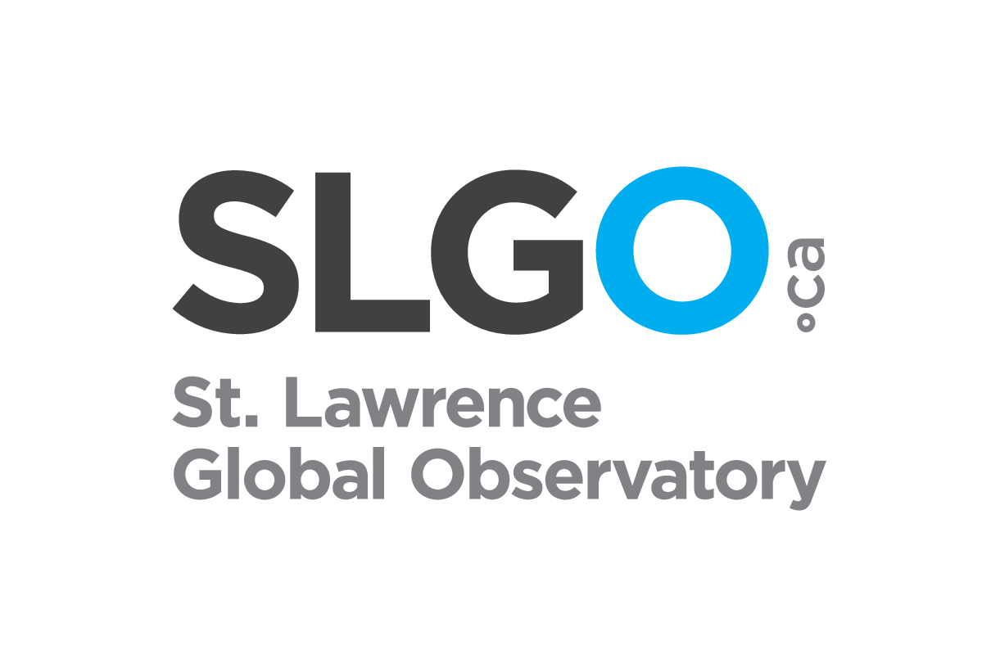
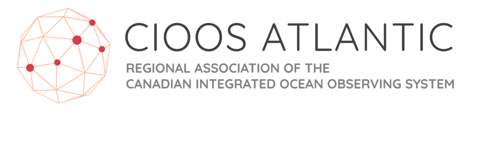

---
hide:
  - navigation
  - toc
---

#

[{ align=center width="500" }](https://cioos.ca/){: .center}

Welcome to the Canadian Integrated Ocean Observing System (CIOOS) documentation website.

## CIOOS Regional Associations

[{ width="300"}](https://cioospacific.ca/)
[{ width="200"}](https://ogsl.ca/en/home-slgo/)
[{ width="300"}](https://cioosatlantic.ca/)
