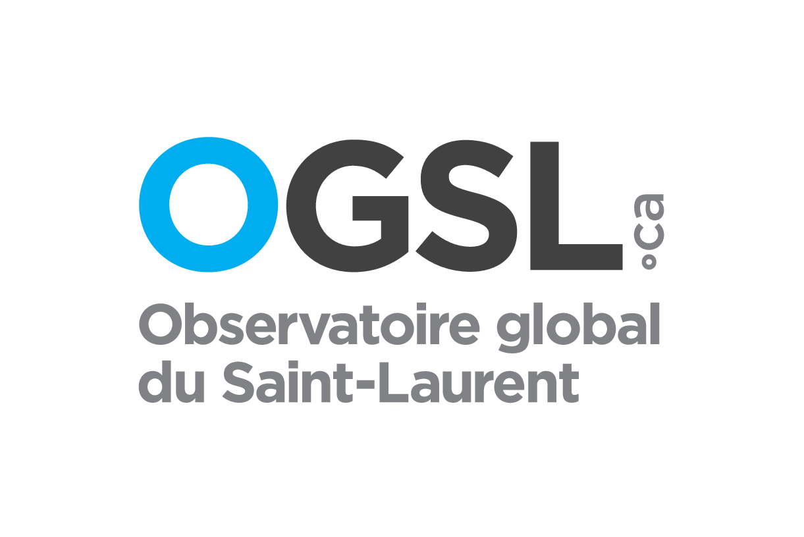
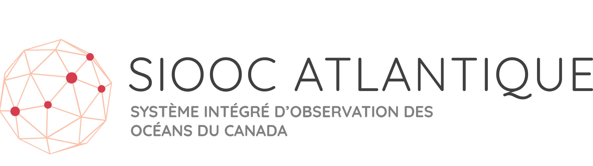

---
hide:
  - navigation
  - toc
---

{ align=center width="500" }

Bienvenue dans la documentation du Système Intégré d'observation des océans du Canada (SIOOC).

# Associations régionales du SIOOC

{ width="300"}  [SIOOC Pacifique](https://cioospacific.ca/fr/accueil/) 

{ width="300"} [OGSL](https://ogsl.ca/fr/accueil/)  

{ width="300"} [SIOOC Atlantique](https://cioosatlantic.ca/fr/) 
