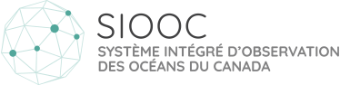

---
hide:
  - navigation
  - toc
---

#

  

  
Bienvenue dans la documentation du système intégré d'observation des océans du Canada (SIOOC).

  <h2>Associations régionales du SIOOC</h2>

  

    
    
    
  

